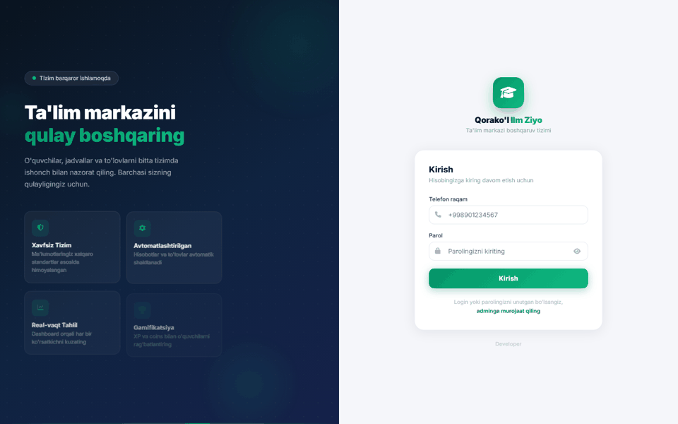
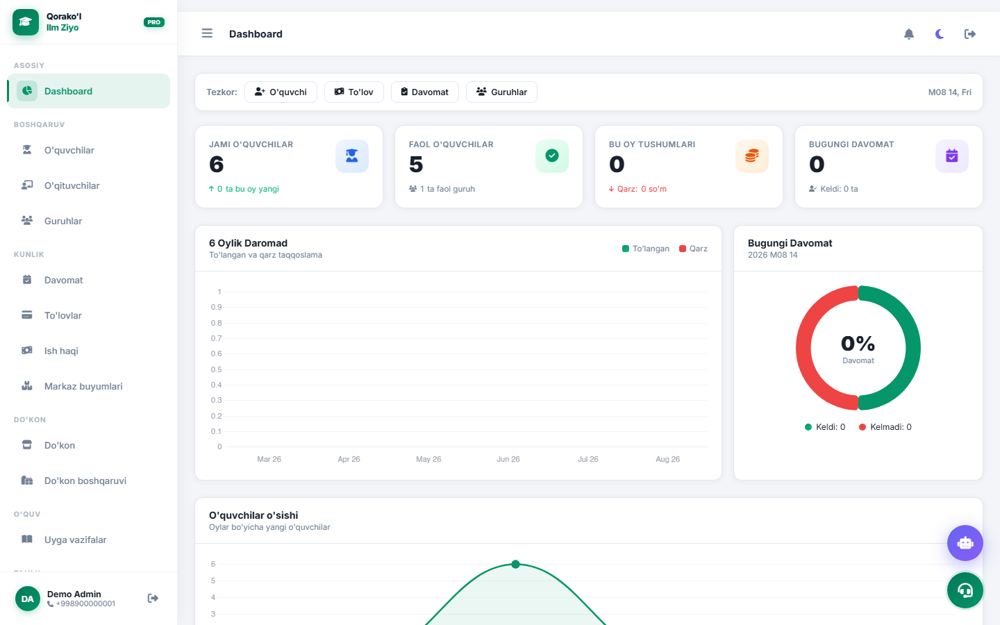
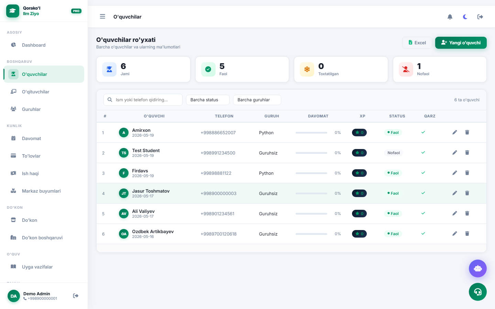
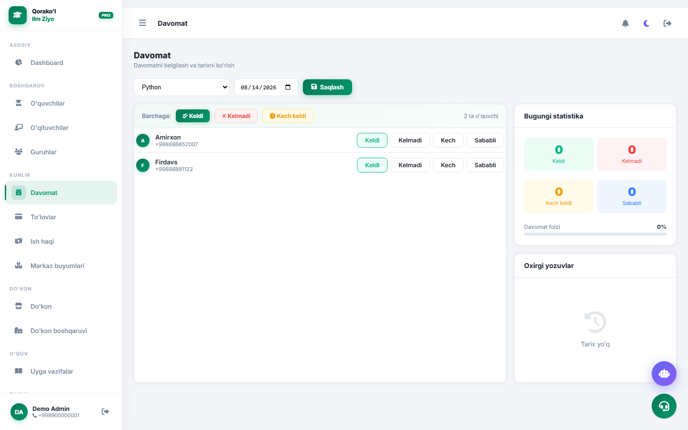
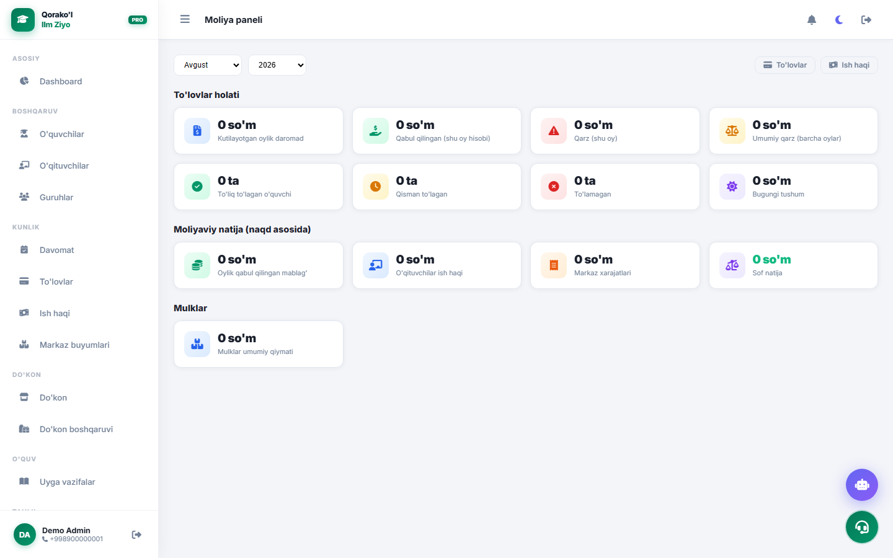
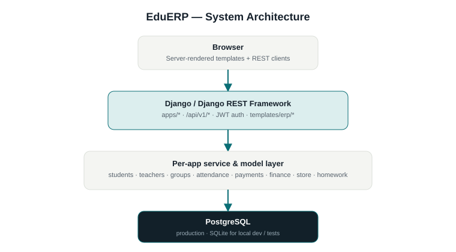

# EduERP

**Ta'lim markazlari uchun ko'p modulli ERP tizimi — Django + DRF asosida, ixtiyoriy biometrik autentifikatsiya, AI admin yordamchisi va kod-sinov sandbox platformasi bilan.**


[English](README.md) | [O'zbek](README.uz.md)

## Tavsif

EduERP ta'lim markazining kundalik jarayonlarini boshqaradi: talaba va o'qituvchi ma'lumotlari, guruh jadvallari, davomat, to'lovlar va moliya/buxgalteriya. Asosiy ERP ustiga uchta ixtiyoriy kengaytma qo'shilgan — bular alohida, mustaqil yoqib-o'chiriladigan modullar, asosiy ERP yadrosining qismi emas:

- **Biometrik autentifikatsiya** (`face_auth`) — jonlilikni tekshirish bilan yuz orqali 2FA
- **AI admin yordamchisi** (`vlt_ai`) — rol bo'yicha huquqlar bilan cheklangan, Claude asosidagi chat yordamchisi
- **ZUKKO** (`zukko`) — kod-sinov masalalarini bajarish uchun sandbox muhiti

## Demo



Real ishlab turgan nusxadan yozib olingan (SQLite dev sozlamalari, `scripts/create_sample_data.py`dan namuna ma'lumotlar). Video: joriy muhitda yozib olinmadi — skrin-yozish vositasi mavjud emas edi; qarang [docs/video/README.md](docs/video/README.md).

## Skrinshotlar

| Xususiyat | Ko'rinish |
|---|---|
| Login |  |
| Dashboard |  |
| O'quvchilar |  |
| Davomat |  |
| Moliya |  |

AI Assistant va face-auth skrinlari bu yerda yozib olinmagan — ikkalasi ham mos ravishda jonli Anthropic API chaqiruvi / ro'yxatga olingan yuzni talab qiladi, bu safar ikkalasi ham ishlatilmadi.

## Xususiyatlar

- Rol asosidagi kirish huquqi bilan (Admin/O'qituvchi/Talaba) talaba, o'qituvchi va guruh boshqaruvi
- Davomatni belgilash va statistika
- To'lovlar, qarzlar va alohida moliya moduli (xarajatlar, aktivlar, audit izi, kvitansiyalar)
- Davomat, uy vazifasi va do'kon bilan bog'langan "KUMUSH" ball/mukofot tizimi
- Xarid tsikli va qo'lda balans tuzatish imkoniyatiga ega ichki do'kon
- Uy vazifasi topshirish va kuzatish
- Reyting jadvali, bildirishnomalar va PDF hisobot eksporti
- Xatolarni avtomatik izlab, qo'lda tahlil qilish imkoniyatiga ega xatolik monitoring moduli
- Ota-ona portali, talaba va o'qituvchi uchun alohida shaxsiy kabinetlar
- **Kengaytma:** jonlilik va kosinus-o'xshashlik tekshiruvi bilan yuz orqali 2FA kirish
- **Kengaytma:** adminlar uchun, ruxsat va tezlikni cheklash bilan ishlaydigan AI chat yordamchisi
- **Kengaytma:** ZUKKO — `RestrictedPython` sandboxida bajariladigan, fokus-rejim sessiyalari va ulashiladigan natijalarga ega o'qituvchi tomonidan tayinlangan kod masalalari

## Arxitektura



Qisqacha:

```
Brauzer (server tomonida render qilingan sahifalar + REST mijozlar)
    ↓
Django / DRF  (apps/*, /api/v1/*)
    ↓
Har bir app uchun xizmat va model qatlami
    ↓
PostgreSQL (production) / SQLite (lokal dev)
```

## AI/ML Quvuri

Ikkita mustaqil, ixtiyoriy quyi tizim — ikkalasi ham ERP'ning asosiy so'rov-javob yo'lining qismi emas:

**AI Yordamchi** — [docs/architecture/ai-assistant-flow.svg](docs/architecture/ai-assistant-flow.svg)
```
Admin chat so'rovi
    ↓
apps.vlt_ai  (ruxsat tekshiruvi, tezlik cheklovi)
    ↓
Anthropic Claude API  (sozlanadigan model, standart claude-haiku-4-5-20251001)
    ↓
Tool-doirasidagi javob
```

**Yuz orqali autentifikatsiya** — [docs/architecture/face-auth-flow.svg](docs/architecture/face-auth-flow.svg)
```
Kameradan tasvir olish
    ↓
Jonlilik tekshiruvi (MiniFASNetV2)
    ↓
Yuz embeddingi (InsightFace / onnxruntime)
    ↓
Shifrlangan embedding bazasi, kosinus-o'xshashlik moslashtirish
    ↓
Kirish qarori (urinishlar chegarasi + bloklash bilan)
```

## Texnologiyalar

| Qatlam | Texnologiya |
|---|---|
| Backend | Django 5.0.6, Django REST Framework 3.15.1 |
| Autentifikatsiya | djangorestframework-simplejwt 5.3.1 |
| Baza | PostgreSQL (`psycopg2-binary`, `dj-database-url`); test/lokal uchun SQLite |
| Admin panel | django-jazzmin |
| AI Yordamchi | Anthropic Claude API |
| Biometrika | InsightFace, onnxruntime, OpenCV, `cryptography` |
| Sandbox | RestrictedPython |
| Eksport | openpyxl, reportlab (PDF) |
| Static/Media | WhiteNoise (static), Cloudinary (production media, ixtiyoriy) |
| Server | Gunicorn |
| Konfiguratsiya | python-decouple |
| Test | pytest, pytest-django, pytest-mock |

## Ma'lumotlar bazasi

Production'da PostgreSQL (`DATABASE_URL` yoki alohida `DB_*` o'zgaruvchilari), lokal ishlab chiqish va test to'plami uchun SQLite. Sxema Django migratsiyalari orqali boshqariladi, har bir domen uchun alohida app (Loyiha strukturasiga qarang).

## API

Barcha endpointlar `/api/v1/` ostida joylashgan:

| Yo'l | Vazifasi |
|---|---|
| `auth/`, `token/`, `token/refresh/`, `token/verify/` | JWT autentifikatsiya |
| `students/`, `teachers/`, `groups/`, `attendance/` | Asosiy ERP resurslari |
| `payments/`, `finance/` | To'lov va buxgalteriya |
| `dashboard/`, `notifications/`, `leaderboard/` | Umumlashtirilgan ko'rinishlar |
| `homework/`, `store/`, `reports/monthly-pdf/` | Ta'lim va mukofotlar |
| `vlt-ai/` | AI yordamchi chat (kengaytma) |
| `face-auth/` | Biometrik kirish (kengaytma) |
| `challenges/` | ZUKKO kod masalalari (kengaytma) |
| `error-monitor/` | Xatolikni aniqlash/tahlil |

Xuddi shu funksionallik server tomonida render qilingan sahifalar (dashboard, portallar, ZUKKO sessiyalari) sifatida ham mavjud — to'liq ro'yxat uchun `config/urls.py` ga qarang.

## Xavfsizlik

- Production'da `SECRET_KEY` uchun **hech qanday standart qiymat yo'q** — agar u belgilanmagan bo'lsa, deploy darhol xatolik bilan to'xtaydi, ma'lum standart qiymat bilan sukut saqlab ishlamaydi.
- `.env` git tomonidan e'tiborga olinmaydi; faqat `.env.example` (faqat o'zgaruvchi nomlari, qiymatlarsiz) repo'ga qo'shilgan.
- Production HSTS, xavfsiz cookie'lar, SSL yo'naltirish va aniq CORS ruxsat ro'yxatini (`CORS_ALLOW_ALL_ORIGINS = False`) talab qiladi.
- Yuz embeddinglari shifrlangan holda saqlanadi (`FACE_ENCRYPTION_KEY`), sozlanadigan urinish chegarasi va bloklash bilan.
- ZUKKO sandboxi yuborilgan kodni xom `exec` emas, `RestrictedPython` orqali bajaradi.

## Testlar

`attendance`, `error_monitor`, `face_auth`, `finance`, `homework`, `store`, `students`, `teachers`, `vlt_ai` va `zukko` bo'yicha 35 ta test fayli, `pytest-django` bilan ishga tushiriladi:

```bash
pytest
```

## Deploy

[Render.com](https://render.com) uchun sozlangan (`render.yaml`, `Procfile`, `runtime.txt`): static fayllar uchun Gunicorn + WhiteNoise, media uchun ixtiyoriy Cloudinary, `DATABASE_URL` orqali PostgreSQL.

## O'rnatish

```bash
git clone https://github.com/avazbektoxirjonovich-commits/edu_erp.git
cd edu_erp
python -m venv venv
source venv/bin/activate  # Windows: venv\Scripts\activate
pip install -r requirements.txt
cp .env.example .env      # so'ng o'z qiymatlaringiz bilan to'ldiring
python manage.py migrate
python manage.py runserver
```

## Muhit o'zgaruvchilari

To'liq ro'yxat uchun [`.env.example`](.env.example) ga qarang. Minimal lokal ishga tushirish uchun zarur: `SECRET_KEY`, `DEBUG`, `ALLOWED_HOSTS`, baza sozlamalari. AI yordamchi va face-auth kengaytmalari o'z kalitlarini talab qiladi (`ANTHROPIC_API_KEY`, `FACE_ENCRYPTION_KEY`) va standart holatda o'chirilgan (`FACE_AUTH_ENABLED=False`).

## Loyiha strukturasi

```
erp_system/
├── config/
│   └── settings/
│       ├── base.py          # umumiy sozlamalar
│       ├── development.py   # lokal dev
│       └── production.py    # Render deploy
├── apps/
│   ├── accounts/     teachers/    groups/       attendance/
│   ├── students/     payments/    finance/      dashboard/
│   ├── homework/     store/       notifications/ error_monitor/
│   ├── face_auth/    # kengaytma — biometrik 2FA
│   ├── vlt_ai/       # kengaytma — AI admin yordamchisi
│   └── zukko/        # kengaytma — kod-sinov sandboxi
├── docs/
│   ├── architecture/  screenshots/  gifs/  video/
│   ├── API.md  DEPLOYMENT.md
├── templates/erp/     # server tomonida render qilingan sahifalar
├── requirements.txt
└── .env.example
```

## Roadmap

- [ ] Avtomatlashtirilgan CI (test to'plami hozircha faqat lokal ishga tushiriladi)
- [ ] Yozib olingan demo GIF/video va skrinshotlar
- [ ] Kengaytirilgan API hujjatlari

## Litsenziya

MIT — qarang [LICENSE](LICENSE).
